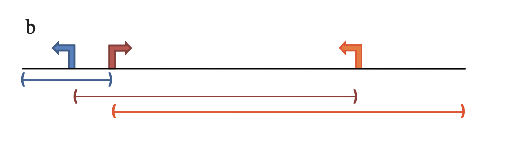

```{r, echo = FALSE}
library(knitr)
knitr::opts_chunk$set(
    error = FALSE,
    tidy  = FALSE,
    message = FALSE,
    warning = FALSE,
    fig.width = 8,
    fig.height = 8,
    fig.align = "center"
)
```

We need the following input data

1. a set of input regions,
2. gene models which provides coordinates of TSSs or genes,
3. a collection of gene sets.

For demonstration, we randomly generate 1000 regions from hg19 human genome.

```{r}
library(rGREAT)
regions = randomRegions(1000, genome = "hg19")
regions
```

On Bioconductor, "gene models" for standard genome are provided via txdb* packages. For
human genome hg19, there is a **TxDb.Hsapiens.UCSC.hg19.knownGene** package.

We use `genes()` to get gene coordinates next `promoters()` to get TSSs of genes.

```{r}
library(TxDb.Hsapiens.UCSC.hg19.knownGene)
g = genes(TxDb.Hsapiens.UCSC.hg19.knownGene)
tss = promoters(g, upstream = 0, downstream = 1)
tss
```

**Question**: Now there are two sources which provide genes, one from **org.Hs.eg.db** and the other from **TxDb.Hsapiens.UCSC.hg19.knownGene**
or **TxDb.Hsapiens.UCSC.hg38.knownGene**. Are the genes identical in the three sources or there are still differences?
For the two verions of TxDb objects, what are the difference?

In the GREAT method, TSSs are extended to construct geneset associated regions. We demonstrate the simplest extension rule:



In this model, each TSS is extended to its upstream and downstream until it reaches the maximal extension (1MB) or its neighbouring TSS.

TSSs can be thought of as regions with zero-width (or width = 1bp), then after sorting TSSs by their coordinates, its neighbouring TSSs
are basically the previous and the next TSSs. Also in this case, the strand information is not needed.

```{r}
strand(tss) = "*"
tss = sort(tss)
```

The processing should be applied per-chromosome. We first split the whole `tss` by chromosomes:

```{r}
tl = split(tss, seqnames(tss))
tl = tl[sapply(tl, length) > 0]
```

As TSSs are sorted, we simply add two columns `left_tss_pos` and `right_tss_pos` which correspond to the coordinates
of each TSS's left and righ neighbours. The left_tss_pos of the first TSS in a chromsome is set to 1 and the right_tss_pos
of the last TSS is set to the total length of that chromosome.

If the `tss` object is extracted from TxDb object, the chromosome length information is already stored in the object, which
can be retrieved by `seqlengths()` function.

```{r}
tl = lapply(tl, function(gr) {
    n = length(gr)
    left = integer(n)
    right = integer(n)
    left[1] = 1
    if(n > 1) {
        left[2:n] = start(gr)[1:(n-1)]
    }
    right[n] = seqlengths(gr)[as.character(seqnames(gr))[1]]
    if(n > 1) {
        right[1:(n-1)] = start(gr)[2:n]
    }
    gr$left_tss_pos = left
    gr$right_tss_pos = right
    gr
})
```

We convert `tl` back to a single `GRanges` object. Here the conversion is a little bit tricky. You cannot
use `unlist(tl)` or `do.call("c", tl)`, while you should first convert `tl` (which is a `list`) to a `GRangesList`
object, then with `unlist()`:

```{r}
tss2 = unlist(as(tl, "GRangesList"))
tss2
```

Now in `tss2`, there are coordinates of the left and right TSSs. The extension of TSS denoted as $(s, e)$ is calculated as

$$
\left\{\begin{aligned}
s &= \max(x - 1000000, x_\mathrm{left}) \\
e &= \min(x + 1000000, x_\mathrm{right}) \\
\end{aligned} \right.
$$

Translating into R code is:

```{r}
s = pmax(start(tss2) - 1000000, tss2$left_tss_pos)
e = pmin(start(tss2) + 1000000, tss2$right_tss_pos)
```

We construct a new `GRanges` object `extended_tss`. This object has the same rows as `tss`.
We also copy the `seqlengths` information to it since we need the chromosome lengths in the later anlaysis.

```{r}
extended_tss = GRanges(seqnames = seqnames(tss), ranges = IRanges(s, e))
extended_tss$gene_id = tss$gene_id
seqlengths(extended_tss) = seqlengths(tss)
extended_tss
```

It is important to note, extended regions in `extended_tss` may overlap.

Next we use an example gene set from the hallmark gene sets:

```{r}
gs = get_msigdb(version = "2024.1.Hs", collection = "h.all")
geneset = gs[[1]]
```

We can extract the extended TSSs that are associated with this gene set:

```{r}
gs_region = extended_tss[extended_tss$gene_id %in% geneset]
```

As regions in `gs_region` may overlap, we need to remove the overlapped regions:

```{r}
gs_region = reduce(gs_region)
```

We calculate the total length of regions in the genome that are associated to this gene set:

```{r}
l1 = sum(width(gs_region))
```

In this example, the total length of the genome is the sumation of all chromosome lengths which are provided by `seqlengths()`.

```{r}
l2 = sum(seqlengths(tss))
```

The proportion:

```{r}
p = l1/l2
```

Next we count the total number of input regions:

```{r}
n = length(regions)
```

And the number of input regions that overlap with the geneset-associated regions.

```{r}
ov = findOverlaps(regions, gs_region)
k = length(unique(queryHits(ov)))
```

In this step, instead of ocerlaping the complete intervals in `regions`, we can also just overlap the middle points:

```{r}
regions_mid = GRanges(seqnames = seqnames(regions), ranges = IRanges(mid(regions)))
```

We have everything and we can calculate the p-value from the Binomial distribution:

```{r}
pbinom(k - 1, n, p, lower.tail = FALSE)
```

The mean of Bionomial distribution is `np`, then the log2 fold enrichment is

```{r}
log2(k/(n*p))
```

If you want to visualize the distribution of input regions as well as the extended regions associated with this gene set,
the Hilbert curve is a nice way to do it:


```{r}
library(HilbertCurve)
hc = GenomicHilbertCurve(species = "hg19", level = 8, mode = "pixel")
hc_layer(hc, gs_region, col = "red", mean_mode = "absolute")
hc_layer(hc, regions, col = "blue", mean_mode = "absolute")
hc_map(hc, fill = NA, border = "grey", add = TRUE)
```


## Set background

In the previous example, we use the whole genome as the background. We can self-define a smaller background.
In the next example, we will restrict the analysis in chromosome 1-22 and XY, and we remove the gap regions from the genome.

In this case, we need to construct a `GRanges` object that contains background regions. Let's first construct a global `GRanges`
object where each row corresponds to the whole chromosome:

```{r}
chromosomes = paste0("chr", c(1:22, "X", "Y"))
chr_len = seqlengths(tss)
chr_len = chr_len[chromosomes]
background = GRanges(seqnames = names(chr_len), ranges = IRanges(1, chr_len))
background
```

Next we extract the gap regions from UCSC table browser, or use the helper function `getGapFromUCSC()`. Be careful
that you choose the correct genome version.

```{r}
gap = getGapFromUCSC("hg19")
```

Then also remove gap regions. This can be easily done by `setdiff()`.

```{r}
background = setdiff(background, gap)
```

Now we have the self-defined background. Next we need to restrict everthing to `background`.

First, the input regions. For simplicity, we use the mid points of the original regions.

```{r}
ov = findOverlaps(regions_mid, background)
regions_mid2 = regions_mid[unique(queryHits(ov))]
```

Overlappping the extended TSSs to `background` is a little bit tricky because intervals in `extended_tss` have overlaps.
If you directly use `intersect()` function, overlapping regions will be merged.

We need to do it in a pairwise mode in two steps. First, linking regions in `extended_tss` and `background`,
i.e. for region $i$, which regions in `background` overlap to it.


```{r}
ov = findOverlaps(extended_tss, background)
ov
```

Then for a region $i$ and a backgrond $j$ that are in one row of `ov`, we can do intersection only for this pair of regions. 
This is done by `pintersect()`:

```{r}
extended_tss2 = pintersect(extended_tss[queryHits(ov)], background[subjectHits(ov)])
```

`extended_tss2` contains extended regions restricted in `background`. Note multiple rows in `extended_tss2` can be linked to a single gene
since the original extended TSSs can be segmented by background.

For the remaining parts of the GREAT anlaysis, it is basically the same;

```{r}
gs_region2 = extended_tss2[extended_tss2$gene_id %in% geneset]
gs_region2 = reduce(gs_region2)

l1 = sum(width(gs_region2))
l2 = sum(width(background))
p = l1/l2
n = length(regions_mid2)

ov = findOverlaps(regions_mid2, gs_region2)
k = length(unique(queryHits(ov)))
pbinom(k - 1, n, p, lower.tail = FALSE)
```


## Thoughts


In ORA, a reasonable background is the union of all genes in the gene set collections under analysis.
Then similarly, we can also set the default background as union of extended TSSs of all genes from the gene set collection.

```r
background = reduce(extended_tss[extended_tss$gene_id %in% unique(unlist(gs))])
```

