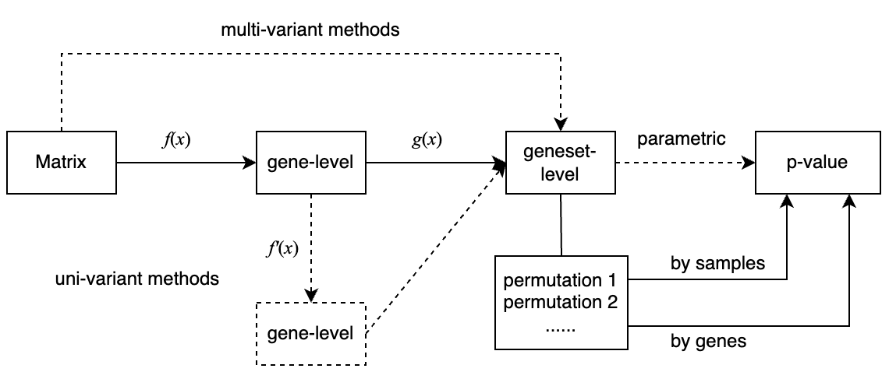
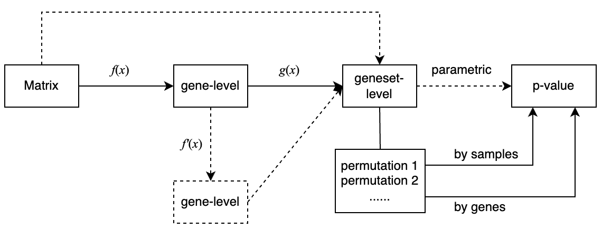

```{r, echo = FALSE}
library(knitr)
knitr::opts_chunk$set(
    error = FALSE,
    tidy  = FALSE,
    message = FALSE,
    warning = FALSE,
    fig.width = 8,
    fig.height = 8,
    fig.align = "center"
)
```

Load the p53 dataset.

```{r}
library(GSEAtopics)
data(p53_dataset)
expr = p53_dataset$expr
condition = p53_dataset$condition
gs = p53_dataset$gs
```


The process of GSEA analysis:




## Gene-level

For the gene-level function, the inputs are:

- the expression matrix
- condition vector

And the output is

- a numeric vector


Let's implement the following gene-level metrics:

- log2 fold change
- signal-to-noise ratio
- t-value
- SAM t-value
- p-value

```{r}
library(matrixStats)
library(genefilter)

gene_level = function(mat, condition, method = "tvalue") {
        
    le = levels(condition)
    l_group1 = condition == le[1]
    l_group2 = !l_group1
    
    mat1 = mat[, l_group1, drop = FALSE]  # sub-matrix for condition 1
    mat2 = mat[, l_group2, drop = FALSE]  # sub-matrix for condition 2

    n1 = ncol(mat1)
    n2 = ncol(mat2)
    miu1 = rowMeans(mat1)
    miu2 = rowMeans(mat2)
    v1 = rowVars(mat1)
    v2 = rowVars(mat2)

    if(method == "log2fc") {
        stat = log2(miu1/miu2)
    } else if(method == "s2n") {
        stat = (miu1 - miu2)/(sqrt(v1) + sqrt(v2))
    } else if(method == "tvalue") {
        sp = sqrt( ((n1-1)*v1 + (n2-1)*v2)/(n1 + n2 - 2) )*sqrt(1/n1 + 1/n2)  # similar variance
        stat = (miu1 - miu2)/sp
    } else if(method == "sam") {
        sp = sqrt( ((n1-1)*v1 + (n2-1)*v2)/(n1 + n2 - 2) )*sqrt(1/n1 + 1/n2)
        stat = (miu1 - miu2)/(sp + quantile(sp, 0.1))
    } else if(method == "pvalue") {
        stat = rowttests(mat, condition)$p.value
        names(stat) = rownames(mat)
    } else {
        stop("method is not supported.")
    }
    
    return(stat)
}
```

Let's validate these metrics. Make sure the returned gene-level vector has genes as names.

```{r}
gene_level(expr, condition, method = "log2fc") |> head()
gene_level(expr, condition, method = "s2n") |> head()
gene_level(expr, condition, method = "tvalue") |> head()
gene_level(expr, condition, method = "sam") |> head()
gene_level(expr, condition, method = "pvalue") |> head()
```

**Question:** consider to implement a gene-leve metric (signed log_p): `-log10(p)*sign(t)`, or the ranks `rank(t) - length(t)/2`.

## Transformation on gene-level

The transformation function accepts a gene-level vector and returns a gene-level vector where values have been updated.

We implement the following transformations:

- identity
- abs
- square
- binary


```r
trans_gene_level = function(gene_stat, method = "identity") {
    if(method == "identity") {
        gene_stat2 = gene_stat
    } else if(method == "abs") {
        gene_stat2 = abs(gene_stat)
    } else if(method == "square") {
        gene_stat2 = gene_stat^2
    } else if(method == "binary") {
        gene_stat2 = ???
    } else {
        stop("method is not supported.")
    }

    return(gene_stat2)
}
```

The implementation of the binary transformation might need more work, as it can be defined as larger or less than a cutoff, or
the filtering is applied on the absolute value of the input gene-level vector, such as `|t| > 2`. We would add an additional argument
to let users to define their binary transformation.


```{r}
trans_gene_level = function(gene_stat, method = "abs", binarize) {
    if(method == "identity") {
        gene_stat2 = gene_stat
    } else if(method == "abs") {
        gene_stat2 = abs(gene_stat)
    } else if(method == "square") {
        gene_stat2 = gene_stat^2
    } else if(method == "binary") {
        gene_stat2 = binarize(gene_stat) + 0  # to convert to numeric
    } else {
        stop("method is not supported.")
    }

    return(gene_stat2)
}
```

Examples of the self-defined function `binarize` are:

```{r}
function(x) x < 0.05  # if the gene scores are p-values
function(x) abs(x) > 2  # if the gene scores are t-values
function(x) abs(x) > 1  # if the gene scores are log2 fold changes
```


Actually `trans_gene_level()` can be integrated into `gene_level()` as `f'(f(...))` also returns gene-level scores.

## Set-level

The geneset-level function accepts two inputs:

- A gene-level vector
- A gene set represented as a vector of gene IDs

Output is simply

- The geneset-level statistic

Let's implement the following methods:

- mean
- median
- maxmean
- wilcox
- ks

```{r}
set_level = function(gene_stat, l_set, method) {

    if(method == "mean") {
        stat = mean(gene_stat[l_set])
    } else if(method == "median") {
        stat = median(gene_stat[l_set])
    } else if(method == "maxmean") {
        s = gene_stat[l_set]
        if(all(s >= 0) || all(s <= 0)) {
            stat = mean(s)
        } else {
            s1 = mean(s[s > 0])
            s2 = -mean(s[s < 0])
            stat = ifelse(s1 > s2, s1, -s2)
        }
    } else if(method == "wilcox") {
        stat = wilcox.test(gene_stat[l_set], gene_stat[!l_set])$statistic
    } else if(method == "ks") {
        od = order(gene_stat, decreasing = TRUE)
        gene_stat = gene_stat[od]
        l_set = l_set[od]
        
        s_set = abs(gene_stat)
        s_set[!l_set] = 0
        f1 = cumsum(s_set)/sum(s_set)
    
        l_other = !l_set
        f2 = cumsum(l_other)/sum(l_other)

        m1 = max(f1 - f2)
        m2 = min(f1 - f2)

        stat = max(abs(m1), abs(m2)) * ifelse(abs(m1) > abs(m2), sign(m1), sign(m2))
    } else {
        stop("method is not supported.")
    }

    return(unname(stat))
}
```

Let's validate `set_level()`:

```{r}
gene_stat = gene_level(expr, condition, method = "s2n")
l_set = names(gene_stat) %in% gs[["p53hypoxiaPathway"]]
set_level(gene_stat, l_set, "mean")
set_level(gene_stat, l_set, "median")
set_level(gene_stat, l_set, "maxmean")
set_level(gene_stat, l_set, "wilcox")
set_level(gene_stat, l_set, "ks")
```

## Calculate p-value from the null distribution

A null distribution of the set-level statistic is generated by permutation. The p-value
can be calculated as one-sided or two-sided.

```{r}
p_null = function(x, null, side = "right") {
    n = length(null)
    if(side == "right") {
        p = sum(null >= x)/n  # P(X >= x)
    } else if(side == "left") {
        p = sum(null <= x)/n  # P(X <= x)
    } else if(side == "both") {
        p = sum(abs(null) >= abs(x))/n  # P(|X| >= |x|)
    }

    return(p)
}
```

## Put together

Now we have all the components ready.

- `gene_level`: five methods,
- `trans_gene_level`: four methods,
- `set_level`: five methods,
- `p_null`: three methods.

ORA and GSEA can be constructed from different combinations of these components:

For ORA:

- `gene_level`: p-value
- `trans_gene_level`: binary
- `set_level`: sum, basically has the same effect as mean
- `p_null`: sample permutation + right-sided

For GSEA (v2):

- `gene_level`: signal-to-noise ratio
- `trans_gene_level`: none
- `set_level`: ks
- `p_null`: sample or gene permutation, one or two-sided

Now we can wrap them into a "framework" function.

```{r}
gsea_framework = function(mat, condition, gene_sets,
    gene_level_method = "tvalue", 
    transform = "identity", binarize = NULL,
    set_level_method = "mean", 
    perm_type = "sample", n_perm = 1000, p_null_side = "both") {
    
    gene_stat = gene_level(mat, condition, method = gene_level_method) 
    gene_stat = trans_gene_level(gene_stat, transform, binarize = binarize)
        
    set_stat = sapply(gene_sets, function(set) {
        l_set = rownames(mat) %in% set
        
        set_level(gene_stat, l_set, set_level_method)
    })
    set_stat
}
```



Let's test it:

```{r}
gsea_framework(expr, condition, gs["p53hypoxiaPathway"])
```

Let's extend it to a list of gene sets and output more columns in the result object.

```{r}
gsea_framework = function(mat, condition, gene_sets,
    gene_level_method = "tvalue", 
    transform = "identity", binarize = NULL,
    set_level_method = "mean", 
    perm_type = "sample", nperm = 1000, p_null_side = "both") {
    
    n_gs = length(gene_sets)

    gene_stat = gene_level(mat, condition, method = gene_level_method) 
    gene_stat = trans_gene_level(gene_stat, transform, binarize = binarize)
        
    l_set_list = lapply(gene_sets, function(set) {
        rownames(mat) %in% set
    })
    
    set_stat = sapply(l_set_list, function(l_set) {
        set_level(gene_stat, l_set, set_level_method)
    })

    ## null distribution 
    set_stat_random = list()
    
    for(i in seq_len(nperm)) {
        
        if(perm_type == "sample") {
            condition_random = sample(condition)
            gene_stat_random = gene_level(mat, condition_random, method = gene_level_method) 
            gene_stat_random = trans_gene_level(gene_stat_random, transform, binarize = binarize)
            
            set_stat_random[[i]] = sapply(l_set_list, function(l_set) {
                set_level(gene_stat_random, l_set, set_level_method)
            })
        } else if(perm_type == "gene") {
            gene_stat_random = structure(sample(gene_stat), names = names(gene_stat))
            
            set_stat_random[[i]] = sapply(l_set_list, function(l_set) {
                set_level(gene_stat_random, l_set, set_level_method)
            })
        } else {
            stop("wrong permutation type.")
        }
        
        if(i %% 100 == 0) {
            message(i, " permutations done.")
        }
    }
    
    set_stat_random = do.call(cbind, set_stat_random)
    
    n_set = length(gene_sets)
    p = numeric(n_set)
    for(i in seq_len(n_set)) {
        p[i] = p_null(set_stat[i], set_stat_random[i, ], p_null_side)
    }
    
    df = data.frame(gene_set = names(gene_sets),
                    stat = set_stat,
                    gs_size = sapply(l_set_list, sum), 
                    p_value = p)
    df$p_adjust = p.adjust(p, "BH")
    df = df[order(df$p_value), ]
    
    return(df)
}
```

```{r}
gsea_framework(expr, condition, gs) |> head()
```
